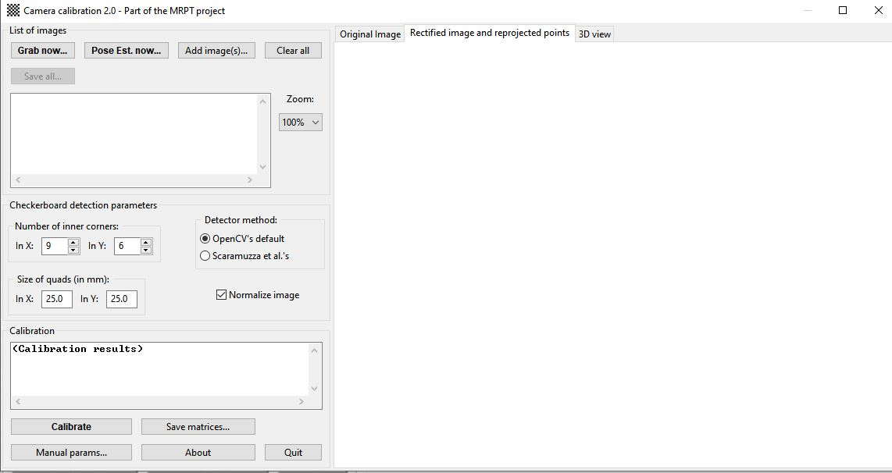
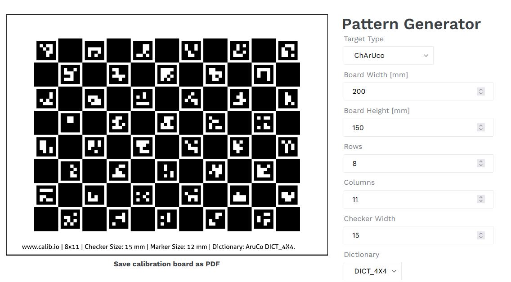

# CameraCalibTools
List of Camera Calibration Tools and patterns

https://www.researchgate.net/post/Which_pattern_circle_pattern_or_checkerboard_pattern_should_be_used_for_automotive_camera_calibration_fisheye_wide_webcam

Calibration Best Practices: https://calib.io/blogs/knowledge-base/calibration-best-practices

# Camera Calibration 2.0 - part of the MRPT project [Win64]

This GUI program allows users to find out the camera parameters of a camera by capturing several images of a checkerboard. The program allows online grabbing or images as well as selection of pre-recorded image files. It also shows the reprojected points, undistorted images and a 3D view of the reconstructed camera poses.

https://www.mrpt.org/list-of-mrpt-apps/application_camera-calib/

https://github.com/MRPT/mrpt

Release of MRPT 1.5.7 https://github.com/MRPT/mrpt/releases

# Calib [source (Win)]

camera calibration tool with gui

https://github.com/Kolkir/calib

# GML camera calibration toolbox
GML C++ Camera Calibration Toolbox. GML Camera Calibration toolbox is a free functionally completed tool for cameras’ calibrating. 
https://library.vuforia.com/sites/default/files/vuforia-library/docs/camera/GML_CameraCalibrationInstall_0.75.exe.zip

Tutorial https://library.vuforia.com/content/vuforia-library/en/articles/Solution/external-camera-calibration.html

http://graphics.cs.msu.ru/en/node/909
https://web.archive.org/web/20190103151950/http://graphics.cs.msu.ru/en/node/909
http://graphics.cs.msu.ru/sites/default/files/download/CalibrationToolbox_Code_071.7z

# Camera Calibration Tools

The application is largely inspired by the Matlab Camera Calibration Toolbox http://www.vision.caltech.edu/bouguetj/calib_doc/ and it provides similar functionality in a stand alone application. Additional features include support for video devices and files. New functionalies such as automatic calibration object detection, hand-eye calibration, camera network calibration and self-calibration are in development for future releases. 

http://www0.cs.ucl.ac.uk/staff/Dan.Stoyanov/calib/main.html

http://www0.cs.ucl.ac.uk/staff/Dan.Stoyanov/calib/download.html

# Automatic videocamera calibration from video stream (v.0.1.1)

https://photogrammetric-vision.weebly.com/software.html

#  OCamCalib: Omnidirectional Camera Calibration Toolbox for Matlab 

The OcamCalib Toolbox for Matlab allows the user (also inexpert users) to calibrate any central omnidirectional camera, that is, any panoramic camera having a single effective viewpoint

https://sites.google.com/site/scarabotix/ocamcalib-toolbox
http://rpg.ifi.uzh.ch/docs/omnidirectional_camera.pdf

https://github.com/urbste/ImprovedOcamCalib

# jcamcalib (java)
https://sourceforge.net/projects/jcamcalib/

# Projector-Camera Calibration / 3D Scanning Software
http://mesh.brown.edu/calibration/software.html

# tsai-calibration

An implementation of Tsai's camera calibration technique.

https://github.com/bailus/tsai-calibration

# video2calibration

Camera intrinsic parameters calibration from chessboard video sequence.

https://github.com/smidm/video2calibration

# Android Camera Calibration

This android app allow for calibration of a mobile camera
https://github.com/rpng/android-camera-calibration

# CameraCal (Win, Linux, Android)

Simple application to calculate the intrinsic and extrinsic parameters with pinhole camera model. These parameters can be used by OpenCV or other frameworks to compensate for lens distortions for scientific purposes.

Android https://play.google.com/store/apps/details?id=fi.tampere.aiboplus.cameracalibapp
Windows version: https://sourceforge.net/projects/aiboplus/files/Windows/
Linux version: https://launchpad.net/~csaba-kertesz/+archive/ubuntu/aiboplus

# VIZARIO.Cam (Android, *offline> $)
https://play.google.com/store/apps/details?id=io.ar4.vizarcam

# BoofCV Computer Vision (Android, Java)

Camera Calibration (chessboard, circles, squares)
https://play.google.com/store/apps/details?id=org.boofcv.android

For instructions and a more detailed explanation:
http://peterabeles.com/blog/?p=204

Full source code:
https://github.com/lessthanoptimal/BoofAndroidDemo

http://boofcv.org/index.php?title=Tutorial_Camera_Calibration

https://github.com/lessthanoptimal/BoofCV

-------------------------------------------------------------------------------
# Calibration Patterns

# Generator

ChArUco, Checkerboard, Circles, Asymetric Circles
https://calib.io/pages/camera-calibration-pattern-generator

# Checker board 9x7
https://www.mrpt.org/downloads/camera-calibration-checker-board_9x7.pdf

# chessboard, circleboard, ChArUco pattern and generator (OpenCV)
https://docs.opencv.org/master/da/d0d/tutorial_camera_calibration_pattern.html
You can find a chessboard pattern in https://github.com/opencv/opencv/blob/master/doc/pattern.png
You can find a circleboard pattern in https://github.com/opencv/opencv/blob/master/doc/acircles_pattern.png

If you want to create your own pattern, you will need python to use https://github.com/opencv/opencv/blob/master/doc/pattern_tools/gen_pattern.py

If you want to create a ChArUco board read tutorial Detection of ChArUco Corners in opencv_contrib tutorial https://docs.opencv.org/master/df/d4a/tutorial_charuco_detection.html. 

# Halcon, Ensenso

https://www.ensenso.com/manual/howto_calibrationpatterns.htm

# Checker (web)

https://eleif.net/checker.html

# Camera-Calibration-Pattern
Checkerboard generator for camera calibration and saving to pdf.
https://github.com/ProximaB/Camera-Calibration-Pattern-Generator

# Chessboard A4
https://github.com/artoolkit/artoolkit5/blob/master/doc/patterns/Calibration%20chessboard%20(A4).pdf

# Chessboard US Letter
https://github.com/artoolkit/artoolkit5/blob/master/doc/patterns/Calibration%20chessboard%20(US%20Letter).pdf

# chessboard-pattern
https://sourceforge.net/projects/jcamcalib/files/jcamcalib/0.7/chessboard-pattern.pdf/download

# more
https://github.com/artoolkit/artoolkit5/tree/master/doc/patterns

----
# No longer available on the web 

# Calib [Win]

The software is using a printed page calibration sheet and the user has to select the surrounding region of a rectangular area of circle reference points” grid to perform the calibration.

http://blogs.auth.gr/tsioukas/category/3d-recording-of-small-objects-monuments-sites/vecad-photogrammetry/
Snapshot: https://web.archive.org/web/20190920090208/http://blogs.auth.gr/tsioukas/category/3d-recording-of-small-objects-monuments-sites/vecad-photogrammetry/

https://drive.google.com/uc?id=0B-16pvtHgnIpYkRBMjQxR2JZWlk&export=download
